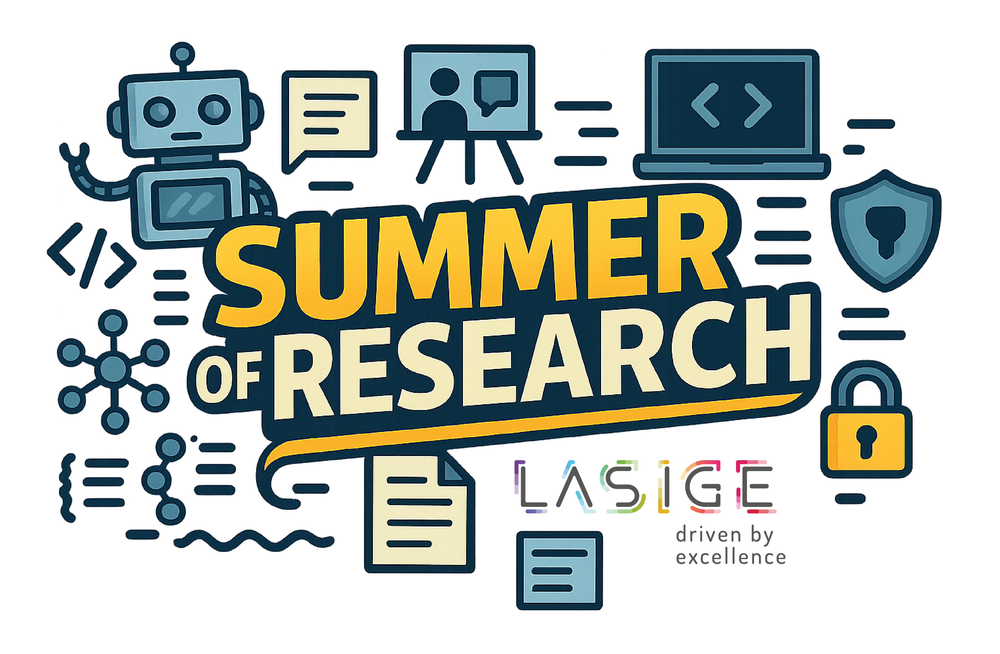

# LASIGE Summer of Research Program

  

## About the Program

The LASIGE Summer of Research Program offers undergraduate and first-year master students at the [Faculty of Sciences of the University of Lisbon](https://www.ciencias.ulisboa.pt) an exceptional opportunity to immerse themselves in cutting-edge research projects under the guidance of experienced researchers. This 3-month program (July to September) provides hands-on research experience in a vibrant academic environment.

## What You'll Gain

### Hands-On Research Experience
* Work directly on active research projects within LASIGE's research groups
* Collaborate with expert mentors from our laboratory
* Contribute to meaningful research with potential for publications or conference presentations
* Experience research in a flexible format (remote work possible during August)

### Comprehensive Training
* Participate in specialized workshops covering research fundamentals:
  * Literature reviews and academic writing
  * Research methodologies
  * Technical skills workshops (e.g., machine learning, data analysis)
  * Presentation skills

### Community & Networking
* Join a supportive community of researchers and fellow students
* Attend academic and social events
* Build connections with researchers in your field of interest
* Discover your potential as a researcher in a collaborative environment

## Research Areas

Our program may offer projects across LASIGE's seven research lines:

* **CPS**: Cyber-Physical Systems
* **DSI**: Data and Systems Intelligence
* **DS2**: Dependable and Secure Decentralized Systems
* **HBI**: Health and Biomedical Informatics
* **IHCI**: Inclusive Human-Computer Interaction
* **RSS**: Reliable Software Systems
* **ToC**: Theory of Computing

## Key Dates for 2025

| Milestone | Date |
|-----------|------|
| Applications Open | May 5th |
| Application Deadline | May 31st |
| Candidate Selection | June 13th |
| Program Start | June 30th |
| Program End | September 30th |

## How to Apply

1. Browse the available projects in the Research Opportunities section of our website (look at the description of the repo for link)
2. Select the project(s) that match your interests and background
3. Click the "Apply Here" button on the project card
4. Submit your application before the deadline (May 31st, 2025)

If you're interested in the program but don't see any currently available projects, you can [express your interest here](https://forms.gle/W5PsetQ4kho1mMC9A) to be notified when new projects are posted.

## Selection Process

Applications will be reviewed by project mentors based on:
* Academic background and relevant coursework
* Technical skills and experience
* Motivation and fit for the specific project
* Potential for growth as a researcher

Shortlisted candidates may be contacted for interviews before final selections are announced on June 13th.

---

*LASIGE Summer of Research is hosted by LASIGE, a research unit of the Department of Informatics at the Faculty of Sciences, University of Lisbon.*